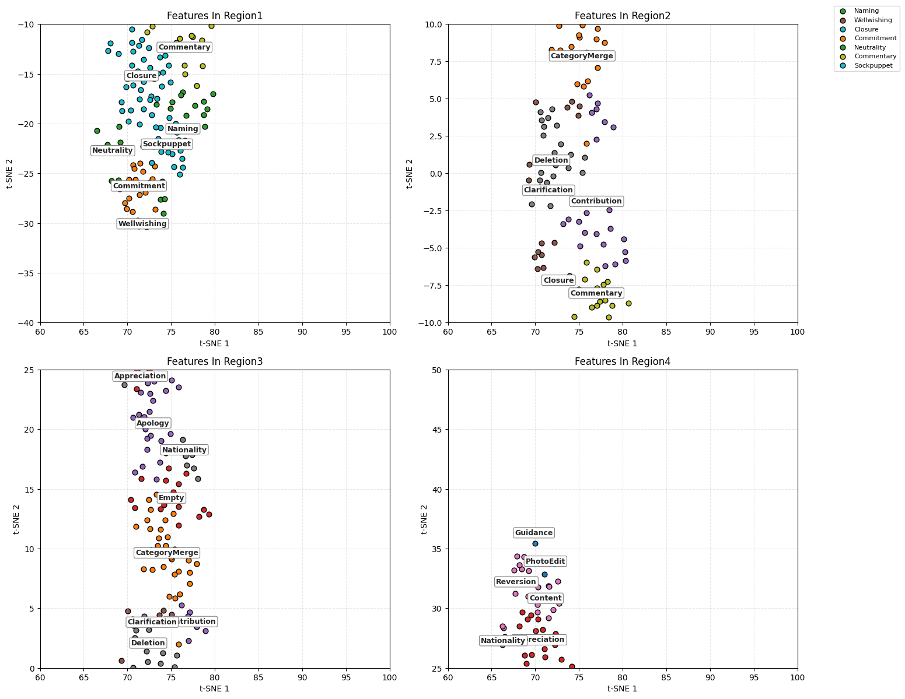

Wikipedia Rooms 
We constructed a semantic map of conversational dynamics using a 3D tensor :XR UxTxF, where each element represents the activation of a feature F (e.g., topic, sentiment, discourse act) for user U at time T. From this structure—extracted from structured deliberative interactions in Wiki rooms—we derived utterance-level embeddings using GPT-2. These embeddings were clustered via KMeans (with k=20) and projected using t-SNE for visual interpretation. Each cluster corresponded to a recurring deliberative role or theme, such as Reversion, Appreciation, Clarification, or Sockpuppet. Using centroid proximity, we selected representative utterances per cluster and manually assigned concise topic labels. These semantic labels revealed structured communicative behavior across conversations, often aligning with classic deliberative roles or modes of contention.

This analysis operationalizes K-lines—internal knowledge activation lines—through language model embeddings, enabling us to map conversation flows into interpretable semantic space. Each cluster captures a distinct region of argumentation or interaction style within a deliberative dialogue, making visible how different topics and tactics coalesce across users and time. 

The t-SNE plots revealed both clustered agreement and outlier disruptions, highlighting where discussion solidified or fragmented. This case study demonstrates how large language models can help surface the structure of collective reasoning, offering tools for platform designers, moderation researchers, and deliberation scholars to track participation quality and topic flow at scale.
